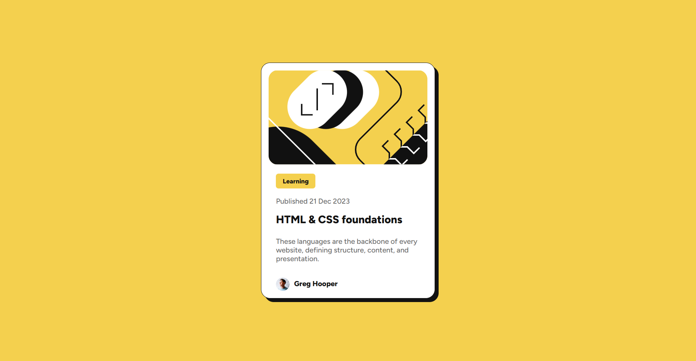

# Frontend Mentor - Blog preview card solution

This is a solution to the [Blog preview card challenge on Frontend Mentor](https://www.frontendmentor.io/challenges/blog-preview-card-ckPaj01IcS). Frontend Mentor challenges help you improve your coding skills by building realistic projects. 

## Table of contents

- [Overview](#overview)
  - [The challenge](#the-challenge)
  - [Screenshot](#screenshot)
  - [Links](#links)
- [My process](#my-process)
  - [Built with](#built-with)
  - [What I learned](#what-i-learned)
  - [Continued development](#continued-development)
- [Author](#author)

## Overview

### The challenge

Users should be able to:

- See hover and focus states for all interactive elements on the page

### Screenshot

 Screenshot of my final result:
 


### Links

- Solution URL: [Add solution URL here](https://your-solution-url.com)
- Live Site URL: [Add live site URL here](https://arikiller.github.io/Blog-Preview-Card/)

## My process

Started pretty quickly and much more effective than the QR Code challenge as I already had a base thanks to that challenge. Managed to get the structure, the css, fonts, etc... Pretty much together in just some minutes.

Next, I need to figure out how to make everything fit correctly into place, as now there are 2 div class one inside the other and pretty much everything needs a bit of css to make it look like the preview, but its getting there.

It actually wasnt as easy as I thought, I changed a few things, using strong and small elements to have an easier time giving each thing an style, and it actually made it look much closer to the final design, but I can see that some things are off. Might go back to trial and error as I dont know what to change to make it look more alike.

Still need to make it react to the pointer.

Made it much more alike and was able to make it reactive to the pointer so the text turns yellow. Also made the shadow effect of the whole thing.

### Built with

- Semantic HTML5 markup
- CSS custom properties

### What I learned

I can say that Im enjoying this one more as I noticed now I know how to do it properly and I can start doing it rather than guess how to do it.

Its true that having two div classes at first was a bit hard to manage but 5 minutes later had it figured out as I didnt know I had to put one inside the other, but pretty cool.

Use more elements to be able to add an style to each thing, as every phrase as a different one. It looks better now but I can see its not perfect yet.

Learnt how to make text reactive to the pointer making it change color, so cool. And how to make a shadow effect.

This is how the HTML was before:

```html
<div class="card">
  
  <div class="content">
    <h2>Learning</h2>

    <p>Published 21 Dec 2023</p>

    <h1>HTML & CSS foundations</h1>

    <p>languages are the backbone of every website, defining structure, content, and presentation.</p> 

    <p>Greg Hooper</p>
  </div>
</div>
```

And this is how is for now:

```html
<div class="card">
  
  <div class="content">
    <h2>Learning</h2>

    <small>Published 21 Dec 2023</small>

    <h1>HTML & CSS foundations</h1>

    <p>These languages are the backbone of every website, defining structure, content, and presentation.</p> 


    
    <strong>Greg Hooper</strong>
  </div>
</div>
```

Used new things in the css like clear and finally understood display and float, now I know those two usually dont go together.

```css
.content small{
  color:hsl(0, 0%, 42%);
  font-size: 16px;
  font-weight: 500;
  display:flex;
  float:left;
  clear: left;
  margin-top: 8px;
  margin-bottom: 8px;
}
```

How I did the small box for Learning:

```css
.content h2 {
  color: hsl(0, 0%, 7%);
  font-weight: 800;
  font-size: 14px;
  margin: 0;
  background-color: hsl(47, 88%, 63%);
  padding: 10px;
  border-radius: 6px;
  float:left;
}
```

How I made the text reactive:

```css
.content h1 {
  color: hsl(0, 0%, 7%);
  font-size: 24px;
  font-weight: 800;
  display: inline-block;
  margin-top: 8px;
  margin-bottom: 8px;
  cursor: pointer;
  transition: color 0.3s ease;
}

.content h1:hover{
  color: hsl(47, 88%, 63%);
}
```

How I made the shadow effect:

```css
.card {
  width: 350px;
  max-width: 100%;
  text-align: center;
  box-shadow: 8px 8px 0px 0px hsl(0, 0%, 7%);
  padding: 16px;
  background-color: white;
  border-radius: 20px;
  display: block;
  border: 1px solid hsl(0, 0%, 7%);
}
```

### Continued development

Im not comfortable yet with styling the page also it still takes me a bit on how to organise the structure and knowing what element works better for each different thing.

But I have learnt a lot and feel a bit more comfortable knowing how to tell the difference between elements.

## Author

- GitHub - [@AriKILLER](https://github.com/AriKILLER)
- Frontend Mentor - [@AriKILLER](https://www.frontendmentor.io/profile/AriKILLER)
- Discord - [@Ari_KILLER]
